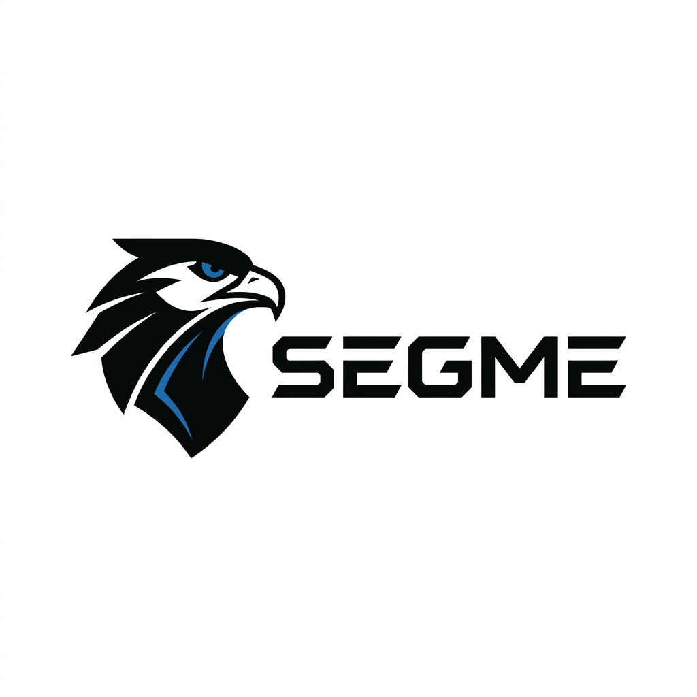

<p align="center">
  
</p>

<p align="center">
  
  
  
  
  
</p>

# SEGME: Next-Gen Data Compression

SEGME is an experimental lossless compression engine focused on structured logs, SQL dumps, text-like data, and mixed binary workloads.

The project explores a hybrid compression architecture that combines dynamic template mining, columnar variable encoding, LZ-style matching, entropy coding, binary-local transforms, arithmetic numeric compression, and safe fallback compression.

The goal is not to claim universal superiority over mature codecs, but to investigate where domain-aware reversible transforms can outperform generic compressors such as Deflate.

SEGME is currently research-oriented and browser-friendly. It is written in TypeScript and can run directly in modern web environments, including Web Workers.

---

## Why SEGME exists

Most general-purpose compressors operate mostly at the byte level. That works well for arbitrary files, but it can miss structure that is obvious in real-world logs and data dumps:

```txt
timestamp level service route status latency trace_id
timestamp level service route status latency trace_id
timestamp level service route status latency trace_id
````

SEGME tries to expose that structure before applying byte-level compression.

Instead of only compressing a stream of bytes, SEGME can transform the input into:

```txt
templates
line structure
columns of variables
numeric deltas
dictionary-coded values
residual raw data
binary-local transformed blocks
```

Then each part is compressed using the most appropriate internal strategy.

---

## Current status

SEGME is experimental.

It is suitable for:

* Research into lossless compression
* Log compression experiments
* Browser-based compression demos
* SQL dump compression tests
* Compression benchmarking
* Educational exploration of LZ, entropy coding, and structural transforms

It is not yet intended as a drop-in replacement for production storage systems.

---

## Main ideas

SEGME combines several reversible techniques:

* Dynamic template mining for structured logs
* Columnar encoding of extracted variables
* Numeric delta and delta-of-delta encoding
* Golomb-Rice encoding for Laplace-like numeric deltas
* Markov-style template repetition coding
* LZ matching with hash-based match discovery
* Canonical Huffman coding
* rANS-style entropy coding for selected streams
* RLE and fill-stream optimization
* Arithmetic numeric compression
* Binary-local transforms for non-text data
* Matrix transpose and byte shuffle transforms
* DeflateRaw fallback for general-purpose safety
* Round-trip validation before selecting a compressed candidate
* Web Worker support for non-blocking browser execution

---

# Mathematical model

SEGME treats compression as a constrained optimization problem over a set of reversible candidate transforms.

Given an input byte sequence:

$$
x = (x_1, x_2, \ldots, x_n)
$$

with each byte satisfying:

$$
x_i \in {0,1,2,\ldots,255}
$$

the compressor evaluates a set of reversible candidates:

$$
\mathcal{C} = {c_1,c_2,\ldots,c_m}
$$

Each candidate has an encoder:

$$
E_c
$$

and a decoder:

$$
D_c
$$

The compressor selects the smallest valid encoded candidate:

$$
c^{\ast}
========

\underset{c \in \mathcal{C}}{\arg\min}
\ |E_c(x)|
$$

subject to exact reconstruction:

$$
D_c(E_c(x)) = x
$$

In this model:

* `E_c` means the encoder associated with candidate `c`.
* `D_c` means the decoder associated with candidate `c`.
* `|E_c(x)|` means the encoded size of candidate `c`, measured in bytes or bits.

This means every transform is treated as a hypothesis. A transform is only useful if it reduces description length and preserves exact reconstruction.

---

## Entropy target

For a discrete symbol source named `X`, the theoretical lower bound is the Shannon entropy:

$$
H(X)
====

-\sum_{s \in \Sigma} p(s)\log_2 p(s)
$$

A practical entropy coder tries to approach:

$$
L(X) \approx nH(X)
$$

Here, `L(X)` means the encoded length of the source.

SEGME does not assume that the input is independent and identically distributed. Logs, SQL dumps, and structured machine-generated files often contain repeated schemas, repeated fields, monotonic values, and predictable local patterns.

SEGME first tries to expose lower-entropy streams before applying entropy coding.

---

## Compression ratio

The compression ratio is:

$$
R
=

\frac{|C(x)|}{|x|}
$$

The space saving is:

$$
S = 1 - R
$$

For example, if a file of `2.97 MB` is compressed to `306.11 KB`:

$$
R
\approx
\frac{306.11}{2.97 \cdot 1024}
\approx
0.1007
$$

$$
S
\approx
1 - 0.1007
==========

0.8993
$$

This corresponds to approximately:

$$
89.93%
$$

space reduction.

---

# Adaptive candidate selection

SEGME does not force one compression path. It compares multiple reversible candidates and chooses the smallest valid one.

For a block named `B`, the selected representation is:

$$
C(B)
====

\min
\left[
\begin{array}{l}
\mathrm{RAW}(B),\
\mathrm{UINT}(B),\
\mathrm{RLE}(B),\
\mathrm{REP}(B),\
\mathrm{POW}*{\pm}(B),\
\mathrm{NP}*{\pm}(B),\
\mathrm{FACT}(B),\
\mathrm{JOIN10}(B),\
\mathrm{SEQ}(B),\
\mathrm{DEFLATE}(B)
\end{array}
\right]
$$

The decision rule is:

$$
\mathrm{cost}(\mathrm{candidate})
<
\mathrm{cost}(\mathrm{RAW}(B))
$$

If no candidate improves the representation, the block is stored as raw data or as a compact binary integer when appropriate.

---

## Exact reconstruction

Every selected candidate must satisfy:

$$
D(E(x)) = x
$$

SEGME also validates candidates with SHA-256:

$$
\mathrm{SHA256}(D(E(x)))
========================

\mathrm{SHA256}(x)
$$

A candidate is invalid if it is smaller but cannot reconstruct the original input exactly.

---

# Structural transforms

## Dynamic template mining

SEGME models structured text as repeated templates plus variables.

A line can be represented as:

$$
\ell_i
======

\tau_k(v_{i,1}, v_{i,2}, \ldots, v_{i,r_k})
$$

In this expression:

* `ell_i` means the current line.
* `tau_k` means the discovered template.
* `v_i,j` means the extracted variable at position `j`.
* `r_k` means the number of variables in template `k`.

A template is useful when its description length is smaller than storing all matching lines raw.

A simplified Minimum Description Length score is:

$$
G(\tau)
=======

## \sum_{\ell_i \in M_\tau} |\ell_i|

\left(
|\tau|
+
\sum_{\ell_i \in M_\tau}
\sum_j |v_{i,j}|
+
\Omega_\tau
\right)
$$

Here:

* `M_tau` is the set of lines matching template `tau`.
* `|tau|` is the template metadata size.
* `Omega_tau` is overhead for IDs, counters, and stream metadata.

SEGME keeps a template only when:

$$
G(\tau) > 0
$$

This is why SEGME does not rely on hardcoded tokens. It discovers templates dynamically from the input.

---

## Columnar variable model

Once templates are selected, the variables become a matrix:

$$
V^{(k)}
=======

\begin{bmatrix}
v_{1,1} & v_{1,2} & \cdots & v_{1,r_k} \
v_{2,1} & v_{2,2} & \cdots & v_{2,r_k} \
\vdots  & \vdots  & \ddots & \vdots \
v_{m,1} & v_{m,2} & \cdots & v_{m,r_k}
\end{bmatrix}
$$

Each column is compressed independently:

$$
V^{(k)}_{\ast,j}
================

(v_{1,j}, v_{2,j}, \ldots, v_{m,j})
$$

This matters because a column often has a simpler distribution than the original text:

* status codes repeat
* timestamps grow slowly
* latencies have small deltas
* IDs may be monotonic
* routes and names become dictionary-friendly

---

## Numeric delta model

For a numeric column:

$$
a = (a_1,a_2,\ldots,a_n)
$$

SEGME can encode first-order deltas:

$$
\Delta_i = a_i - a_{i-1}
$$

and second-order deltas:

$$
\Delta_i^2 = \Delta_i - \Delta_{i-1}
$$

If the sequence is almost linear, the second-order delta tends to be small, which makes it cheaper to encode.

---

## ZigZag mapping

Signed deltas are mapped to unsigned integers using ZigZag encoding:

$$
Z(d)
====

\begin{cases}
2d, & d \ge 0 \
-2d - 1, & d < 0
\end{cases}
$$

This maps small negative and positive numbers to small unsigned values:

```txt
 0 -> 0
-1 -> 1
 1 -> 2
-2 -> 3
 2 -> 4
```

---

## Golomb-Rice coding

When deltas follow a Laplace-like distribution, many values are near zero. Golomb-Rice coding is efficient for this case.

For an unsigned value named `z` and parameter `k`:

$$
q
=

\left\lfloor
\frac{z}{2^k}
\right\rfloor
$$

$$
r
=

z \bmod 2^k
$$

The encoded length is approximately:

$$
L_k(z) = q + 1 + k
$$

SEGME estimates `k` from the average absolute ZigZag delta:

$$
k
\approx
\max
\left(
0,
\left\lfloor
\log_2
\left(
\mathbb{E}
\left[
|Z(\Delta)|
\right]
\right)
\right\rfloor
\right)
$$

This is useful for columns such as timestamps, counters, latencies, ports, row IDs, and status-like numeric values.

---

## Markov-style template repetition

Template IDs are not independent. In logs, if one template appears, the next line often uses the same template.

SEGME uses a simple Markov-style repetition model:

$$
P(t_i = t_{i-1})
$$

When the current template equals the previous one, the encoder can emit a shorter repeat marker instead of a full template ID.

A simple coding idea is:

$$
t_i
===

\begin{cases}
\mathrm{repeat}, & t_i = t_{i-1} \
\mathrm{new_id}(t_i), & t_i \ne t_{i-1}
\end{cases}
$$

This reduces overhead in long runs of similar log lines or SQL records.

---

# Arithmetic numeric compression

SEGME can also represent numeric blocks using exact arithmetic descriptions.

## Power form

A numeric block named `B` can be represented as:

$$
B = y^n + r
$$

or:

$$
B = y^n - r
$$

where:

$$
r = |B - y^n|
$$

This is useful when a number is exactly a power or close to a power.

Examples:

```txt
1000000000000 -> POW(10,12)
999999999999  -> POW-(10,12,1)
1000000123    -> POW+(10,9,123)
```

---

## Nested exponent form

Sometimes the exponent itself can be compressed:

$$
n = c^l
$$

Then:

$$
B = y^{c^l} \pm r
$$

Example:

```txt
10^65536 = 10^(2^16)
```

Representation:

```txt
NP(10,2,16)
```

This is only selected if it is shorter than the normal power form.

---

## Factor form

If a number has repeated small prime factors:

$$
B = p^s \cdot Q
$$

SEGME can represent it as:

```txt
FACT(p,s,Q)
```

Example:

```txt
810000 = 2^4 · 3^4 · 5^4 = 30^4
```

The final selected representation would likely be:

```txt
POW(30,4)
```

because it is shorter than storing every factor separately.

---

## Decimal join form

Decimal partitioning represents a block as:

$$
B = A \cdot 10^k + D
$$

where `D` has `k` decimal digits.

Example:

```txt
999999999999123123123123
```

can be split as:

```txt
[999999999999][123123123123]
```

so:

$$
B
=

999999999999 \cdot 10^{12}
+
123123123123
$$

Then:

```txt
999999999999 = POW-(10,12,1)
123123123123 = REP(123,4)
```

Result:

```txt
JOIN10(POW-(10,12,1),12,REP(123,4))
```

---

## Sequence of powers

A run of powers can be stored as a sequence:

$$
\mathrm{SEQ}(y,a,b)
===================

\sum_{k=a}^{b} y^k
$$

For example:

$$
2^{137}
+
2^{138}
+
2^{139}
+
2^{140}
$$

can be stored as:

```txt
SEQ(2,137,140)
```

It can also be rewritten as:

$$
2^{137}(1 + 2 + 4 + 8)
======================

15 \cdot 2^{137}
$$

So another possible representation is:

```txt
FACT(2,137,15)
```

SEGME selects whichever representation is shorter.

---

## Binary integer fallback

Some numbers do not have useful mathematical structure.

Example:

```txt
9973
```

It is close to:

```txt
100^2 - 27
```

but this expression is longer than the number itself.

In that case, SEGME can store it as a compact binary integer:

```txt
UINT16(9973)
```

because:

$$
9973 < 2^{16}
$$

The rule is simple:

```txt
If no mathematical structure helps, store the value as a compact integer or raw data.
```

---

# Binary-local transforms

SEGME can apply reversible local transforms before compression. These transforms are useful because they expose patterns that are hidden in the original byte order.

The general sandwich structure is:

```txt
original block
  -> reversible transform
  -> compression
  -> stored payload
```

During decompression:

```txt
stored payload
  -> decompression
  -> inverse transform
  -> original block
```

Mathematically:

$$
B = T^{-1}(T(B))
$$

and the selected candidate must satisfy:

$$
D_T(E_T(B)) = B
$$

---

## Matrix transpose / byte shuffle

When records have fixed-width structure, bytes can be rearranged by position.

Example input:

```txt
A7 F3 00 A8 F4 00 A9 F5 00 AA F6 00
```

As a matrix of width `3`:

```txt
A7 F3 00
A8 F4 00
A9 F5 00
AA F6 00
```

Reordered by columns:

```txt
A7 A8 A9 AA F3 F4 F5 F6 00 00 00 00
```

The zeros become a long run, which is easier to compress.

Representation:

```txt
MATRIX(width=3)
```

For fixed-width numeric records, this is equivalent to:

```txt
BYTE_SHUFFLE(width=4)
```

---

## Delta transform

For smoothly changing byte sequences:

```txt
100, 101, 102, 103, 104
```

the delta transform produces:

```txt
100, 1, 1, 1, 1
```

Definition:

$$
\mathrm{DELTA}(B)_0 = B_0
$$

$$
\mathrm{DELTA}(B)_i
===================

(B_i - B_{i-1}) \bmod 256
$$

Inverse:

$$
B_0 = \mathrm{DELTA}(B)_0
$$

$$
B_i
===

\left(
B_{i-1}
+
\mathrm{DELTA}(B)_i
\right)
\bmod 256
$$

---

## XOR-delta transform

For byte sequences with small bitwise changes:

$$
\mathrm{XORDELTA}(B)_0 = B_0
$$

$$
\mathrm{XORDELTA}(B)_i
======================

B_i \oplus B_{i-1}
$$

Inverse:

$$
B_0 = \mathrm{XORDELTA}(B)_0
$$

$$
B_i
===

\mathrm{XORDELTA}(B)*i
\oplus
B*{i-1}
$$

Example:

```txt
F0 F1 F0 F1 F0
```

becomes:

```txt
F0 01 01 01 01
```

---

## Bitplane transform

The bitplane transform separates bits by position.

For bytes:

```txt
00000001
00000011
00000111
```

the bitplanes are conceptually:

```txt
bit0: 1 1 1
bit1: 0 1 1
bit2: 0 0 1
bit3..bit7: 0 0 0
```

This can expose long zero runs in high bitplanes.

---

# Byte-level compression

## LZ-style matching

For byte-level compression, SEGME uses LZ-style references.

A repeated substring can be encoded as a match:

$$
m = (d,\ell)
$$

where:

* `d` is the backward distance.
* `ell` is the match length.

Instead of storing:

$$
x_i,x_{i+1},\ldots,x_{i+\ell-1}
$$

the encoder stores:

$$
(d,\ell)
$$

The match is useful when:

$$
\mathrm{cost}(d,\ell)
<
\mathrm{cost}(x_i,\ldots,x_{i+\ell-1})
$$

SEGME uses hash-based matching and multiple parsing modes to decide which matches are worth emitting.

---

## Canonical Huffman coding

For a symbol named `s` with probability `p(s)`, an ideal code length is:

$$
\ell(s)
\approx
-\log_2 p(s)
$$

Huffman coding assigns integer code lengths that minimize expected length under prefix-code constraints:

$$
\mathbb{E}[L]
=============

\sum_{s \in \Sigma}
p(s)\ell(s)
$$

SEGME uses canonical Huffman codes for compact and deterministic representation.

---

## rANS entropy coding

SEGME also uses rANS-style entropy coding for selected streams.

At a high level, ANS maintains an integer state named `q` and encodes symbols by transforming the state according to a probability model:

$$
q' = C(s,q)
$$

and decodes with the inverse operation:

$$
(s,q) = C^{-1}(q')
$$

The practical benefit is that rANS can approach arithmetic-coding efficiency while remaining fast and table-driven.

---

# Architecture

SEGME uses an adaptive candidate pipeline.

For each input, the compressor evaluates several reversible paths and selects the smallest valid output.

```txt
input
  |
  |-- raw byte-oriented core
  |-- log/template transform
  |-- columnar variable transform
  |-- arithmetic numeric transform
  |-- binary-local transform
  |-- DeflateRaw fallback
  |
validated candidates
  |
smallest round-trip-safe result
```

The most important transform is the template-line model:

```txt
original lines
  |
template mining
  |
template ids + raw lines + variable columns
  |
per-column encoding
  |
LZ + entropy coding
```

---

# Example results

The following results are from local benchmark runs. They should be reproduced on your own machine before drawing conclusions.

| File                                       | Original | SEGME/NDC | Deflate level 9 | Result        |
| ------------------------------------------ | -------: | --------: | --------------: | ------------- |
| `test_logs.txt`                            |  2.97 MB | 306.11 KB |       443.16 KB | SEGME smaller |
| `asistapp_prod_backup_20260425_061325.sql` | 16.73 MB |   4.08 MB |         5.35 MB | SEGME smaller |
| `Codex Installer.exe`                      |  1.12 MB | 446.74 KB |       494.50 KB | SEGME smaller |
| `WinDirStat-x64.msi`                       |  2.37 MB |   1.58 MB |         1.58 MB | roughly tied  |
| TypeScript source file                     | 71.27 KB |  16.74 KB |        16.75 KB | roughly tied  |

These results show the current strength of SEGME: structured logs and text-like data with repeated schema. For already-compressed binaries or installer formats, SEGME falls back to general compression behavior.

---

# Compression model

At a high level, SEGME uses this flow:

```txt
1. Analyze the input
2. Detect whether it looks textual or binary
3. Try structural transforms when appropriate
4. Compress each candidate
5. Decompress each candidate internally
6. Verify exact byte-for-byte round trip
7. Select the smallest valid result
```

This validation step is important. SEGME is designed to avoid returning a compressed file that cannot reconstruct the original data.

---

# Web Worker support

SEGME includes a Web Worker interface for running compression without blocking the UI thread.

Example worker entry:

```ts
import { compressNDC, decompressNDC, compressNDCBlobChunked } from './ndc_core';

self.onmessage = async event => {
  const msg = event.data;

  if (msg.op === 'compress') {
    const result = await compressNDC(msg.data);

    postMessage(
      {
        id: msg.id,
        type: 'result',
        file: result.file,
        hash: result.hash,
      },
      [
        result.file.buffer,
        result.hash.buffer,
      ]
    );
  }

  if (msg.op === 'decompress') {
    const data = await decompressNDC(msg.data);

    postMessage(
      {
        id: msg.id,
        type: 'result',
        data,
      },
      [
        data.buffer,
      ]
    );
  }

  if (msg.op === 'compressBlob') {
    const result = await compressNDCBlobChunked(
      msg.blob,
      undefined,
      msg.chunkSize
    );

    postMessage(
      {
        id: msg.id,
        type: 'result',
        file: result.file,
        hash: result.hash,
      },
      [
        result.file.buffer,
        result.hash.buffer,
      ]
    );
  }
};
```

---

# Basic usage

```ts
import { compressNDC, decompressNDC } from './ndc_core';

const input = new TextEncoder().encode('hello hello hello');

const compressed = await compressNDC(input);
const restored = await decompressNDC(compressed.file);

console.log(compressed.file.length);
console.log(restored);
```

---

# Blob/chunked usage

For larger files in the browser:

```ts
import { compressNDCBlobChunked } from './ndc_core';

const result = await compressNDCBlobChunked(
  file,
  message => {
    console.log(message);
  },
  16 * 1024 * 1024
);

console.log(result.file);
console.log(result.hash);
```

---

# Benchmarking

To compare against Deflate:

```ts
import { compressNDC, deflateEnc } from './ndc_core';

const ndc = await compressNDC(data);
const deflate = await deflateEnc(data);

console.table({
  original: data.length,
  ndc: ndc.file.length,
  deflate: deflate.length,
});
```

For meaningful results, benchmark across multiple categories:

* structured logs
* JSON logs
* SQL dumps
* TypeScript or JavaScript source
* CSV files
* binary installers
* already-compressed archives
* random or high-entropy data

---

# Strengths

SEGME performs best when the input has structure that can be discovered dynamically:

* repeated log templates
* repeated SQL tuple shapes
* stable JSON keys
* repeated routes or service names
* numeric columns with small deltas
* status codes, counters, latencies, timestamps
* semi-structured text with recurring fields
* binary records with fixed-width structure

---

# Limitations

SEGME is not expected to outperform mature compressors on every file.

It may not provide large gains for:

* encrypted data
* random data
* already-compressed archives
* media files
* some installers
* formats that contain compressed internal streams

In these cases, SEGME relies on fallback strategies to avoid large regressions.

---

# Design principles

SEGME follows these principles:

1. **Lossless only**
   The decompressed output must match the original input exactly.

2. **Dynamic discovery**
   No hardcoded log tokens or fixed dictionaries are required.

3. **Adaptive selection**
   Transforms are candidates, not assumptions.

4. **Round-trip validation**
   A candidate must successfully decompress before being selected.

5. **Browser compatibility**
   The implementation targets modern TypeScript and Web APIs.

6. **Research transparency**
   Compression ratios should be reproducible and benchmarked honestly.

---

# Roadmap

Planned research directions:

* Context Tree Weighting for residual literal streams
* Improved Markov coding for template sequences
* Better column dependency modeling
* More efficient Golomb-Rice modeling for numeric deltas
* Optional trained dictionaries for repeated operational logs
* Faster worker-based compression for large files
* Streaming decompression
* Corpus-based benchmark suite
* CLI runner for reproducible compression tests
* WASM acceleration for entropy coding
* More binary-local transforms for fixed-record files
* More compact metadata packing for adaptive block selection

---

# Repository goals

This project is intended to become a serious open-source compression research playground.

The target audience includes:

* compression researchers
* observability engineers
* log platform builders
* browser tooling developers
* database backup tooling authors
* systems programmers
* students studying compression algorithms

The long-term goal is to explore whether domain-aware, dynamically discovered structure can make lossless compression more effective for modern machine-generated data.

---

# Contributing

Contributions are welcome.

Useful contributions include:

* benchmark results on real datasets
* new reversible transforms
* decompression safety tests
* performance profiling
* worker and streaming improvements
* documentation
* corpus design
* comparisons against gzip, zstd, brotli, lz4, xz, and bzip2

Please include:

* input file type
* original size
* SEGME/NDC compressed size
* baseline compressor and level
* compression time
* decompression time
* whether round-trip verification passed

---

# Safety and correctness

Every compressed candidate should be considered invalid unless it passes round-trip verification.

The expected invariant is:

```txt
decompress(compress(input)) === input
```

Mathematically:

$$
D(E(x)) = x
$$

SEGME uses SHA-256 verification to protect against silent corruption:

$$
\mathrm{SHA256}(D(E(x)))
========================

\mathrm{SHA256}(x)
$$

---

# License

Choose a license before publishing.

Recommended options:

* MIT for maximum adoption
* Apache-2.0 for patent protection
* MPL-2.0 if you want modifications to core files to remain open

---

<p align="center">
  Developed by <b>Hecho con IA</b>
</p>

## Short description

Dynamic lossless compression engine for structured logs, SQL dumps, and mixed data, using template mining, columnar transforms, arithmetic numeric compression, binary-local transforms, LZ matching, entropy coding, and validated adaptive fallback.
